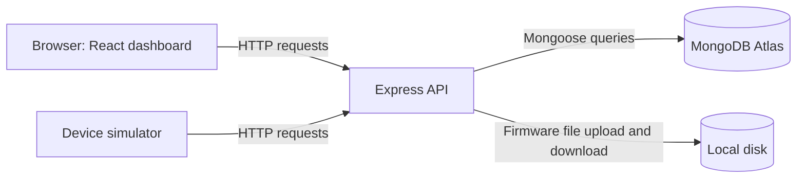

# 01 — Architecture and frameworks

[Guide index](README.md) · Next: [HTTP and REST](02-http-and-restful-apis.md)

## What Nexus solves

Nexus provides a central place to register IoT devices, view their last reported firmware and activity, and upload firmware releases. A device asks the server whether a newer release exists and downloads it. OTA means **over the air**: transferring an update over a network instead of connecting a programming cable.

The implemented demonstration covers update discovery and download. It does not flash a microcontroller, reboot hardware or confirm a successful installation.

## The three layers

- **Presentation:** React displays forms and devices. It collects input and shows results.
- **Application:** Express checks requests, enforces permissions, compares versions and coordinates storage.
- **Data:** MongoDB stores administrators, devices and release metadata; firmware files are kept on the backend's local disk.

The simulator is another API client. It does not need React. The browser does not connect directly to Atlas because database credentials and access rules belong on the backend.

These are logical layers. The React development server and Express backend run locally on separate ports, while MongoDB Atlas stores the records.

## What each tool does

| Tool | Responsibility |
|---|---|
| JavaScript | Language used for browser code, backend code and the simulator |
| React | Library for building the user interface from components |
| Vite | Frontend development server and build tool |
| Express | Backend framework for routing and middleware |
| Bun | JavaScript runtime and package manager used by project commands |
| MongoDB / Atlas | Document database / hosted database service |
| Mongoose | Object-document mapper: schemas and query methods for MongoDB |

MERN stands for MongoDB, Express, React and Node.js. Nexus uses the same application layers with Bun as its JavaScript runtime. A runtime executes code; a framework supplies structure; a package manager installs libraries.

## Framework alternatives in the module

ASP.NET Core usually uses C#/.NET for the backend. Spring Boot commonly uses Java and the Spring ecosystem. Both can expose REST APIs and work with React, relational databases or MongoDB. Both support asynchronous approaches; MERN is not automatically faster or more scalable.

MERN is a reasonable choice here because JavaScript is shared across the project, React fits an interactive dashboard, and document records fit the small device registry. SQL would also work. MongoDB does not remove the need to design schemas, relationships or validation.

Bootstrap supplies ready-made CSS components and layout utilities; Tailwind supplies utility classes for composing styles. Angular is a broader frontend framework with conventions and integrated facilities. Nexus uses React and custom CSS, so these alternatives are theory to compare, not dependencies to claim in the demo.

## Trace one operation

When an administrator requests the device list:

1. `DeviceList.jsx` calls `fetch('/api/devices')`; this list route is currently public.
2. The local Vite proxy forwards the request to Express.
3. The controller queries devices and returns their stored status.
4. Express returns JSON; React stores the array in state and renders table rows.

This separation makes changes easier to locate: layout belongs in React, permission checks in middleware, and database queries in backend code.

**Self-check:** If React is closed, can the simulator still check for an update? Yes: it calls the backend independently. If Atlas is unavailable when Express starts, the backend does not begin listening.
